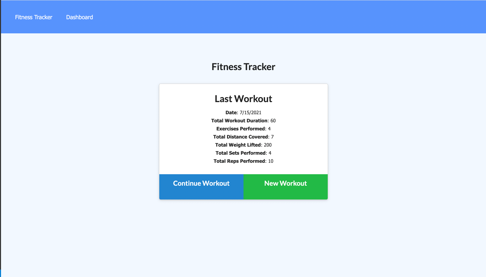

# Workout Tracker

## Table of Contents
[Description](#description)\
[Motivation](#motivation)\
[User Story](#user-story)\
[Technologies](#technologies)\
[License](#license)\
[Process](#process)\
[Screen Shot](#screen-shot)\
[Links](#links)


## Description

The workout tracker helps you to stay motivated by tracking your workouts.  You can track resistance training including exercise, weight, sets, reps, and duration as well as cardio with exercise, distance, and duration.  All of this gets complied to your homepage and dashboard, so you can see a snap shot of your progress.

## Motivation

It's difficult to stick with healthy decisions when we have no sense of progess.  The workout tracker helps us to stick to our workout goals by tracking our progess.  This helps users lead happier and healthier lives.

## User Story

```md
AS A user
I WANT to be able to view, create, and track daily workouts. Also, I want to be able to log multiple exercises in a workout on a given day.
SO THAT I can stay on top of my workout goals.
```

## Technologies

* HTML & CSS
* JavaScript
* MongoDB
* Dependencies: Express, Mongoose, and Morgan


## License

[MIT License](https://choosealicense.com/licenses/mit/)

## Process

* This project had some starter code.
* Based on the start code I created the workout model and then the routes from there.
* The biggest challenges for this project was getting use to working with Mongoose and getting the routes set up.
* The successes for this project was getting a better getting more exposure to working with Express and Mongoose to help solidify my understanding of those technologies.

## Screen Shot



## Links

Repository: https://github.com/harviator/workout-tracker \
Deployed: https://radiant-gorge-41427.herokuapp.com/?id=60f0cac4efd2010015e1372c